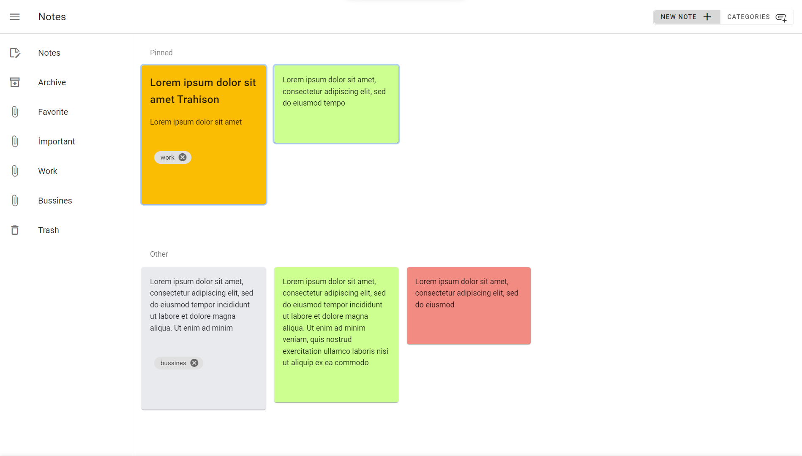

# Notes App Frontend

Google is a note-taking application built with similar logic and features. This is the frontend of the notes app. The backend is built with Json Server. The frontend is built with Vue.js and Vuetfy.
This is personal project to learn Vue.js and Vuetify.

You can use this application in your personal projects and commercial projects. You can also modify this application. You can also use this application as a template for your projects.

## Used technologies

- Vue.js
- Vuetify
- Json Server
- Vue Router
- Vuex
- Axios
- Vue Vlidate

# Screenshots

